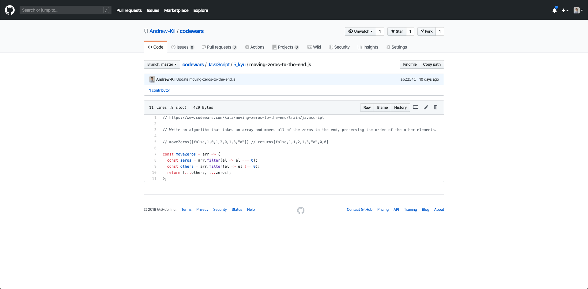

    

    
    <!--  -->
    
    

---

Codewars is a platform similar to <a target="_blank" href="https://leetcode.com/">Leetcode</a> and <a target="_blank" href="https://www.hackerrank.com/">HackerRank</a>, with a community driven ecosystem where users submit and solve coding challenges to improve their coding skills.

<h2 align="center"><u>Kata</u></h2>

    

Katas are assigned a difficulty level (8 kyu is the easiest, 7 kyu is more difficult, etc).

This is an example of a codewars kata where you are asked to write an algorithm that moves all of the zeros to the end while preserving the order of the other elements. The solution must pass all test cases in order to be accepted as a valid solution.

Once the solution is accepted, the user is taken to a list of the highest rated solutions submitted by other users where you can learn different approaches to solving that kata and vote for your favorite solutions.

